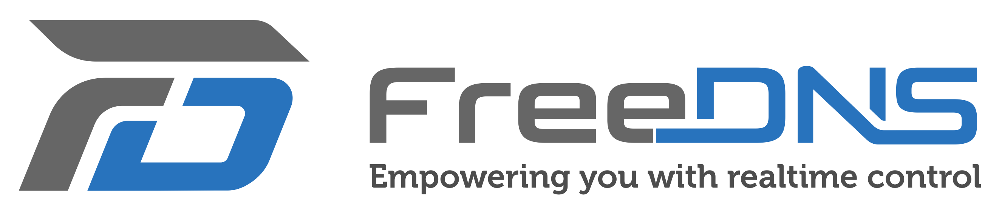

# [Akshu](https://akshu.ar)

## [https://akshu.ar](https://akshu.ar)

**Proyecto TPO de HTML, CSS y JS para el programa Codo a Codo.** 

*El proyecto es una presentacion de una tienda web de venta de productos y/o servicios.*

## **Integrantes**

> ### **LUNA ARECHA, Julian Ismael** *(Representante)*
>
> - Usuario GitHub: julian.arecha@gmail.com
> - Link de Github: <https://github.com/julianismaellunaarecha>
>

> ### **PONCE, Viviana Mercedes**
>
> - Usuario GitHub: vivianaponce@gmail.com
> - Link de Github: <https://github.com/vmponce>
>

## **Detalles tecnicos**

Se publica automaticamente en *[akshu.ar](https://akshu.ar)* luego de cada commit a develop, tarda alrededor de 4 segundos en desplegar.

<table>
  <tr>
    <td>
        Registrado en dominio Argentino a traves de <a href="https://nic.ar">Nic.ar</a>.
    </td>
    <td>
        
    </td>
  </tr>
    <tr>
    <td>
        Utiliza servidores DNS de <a href="https://freedns.afraid.org">FreeDNS</a>.
    </td>
    <td>
        
    </td>
  </tr>
    <tr>
    <td>
        Hosteado en un servidor dedicado.
    </td>
    <td>
        
    </td>
  </tr>
    <tr>
    <td>
        Instalado por <a href="https://www.jenkins.io">Jenkins</a> automaticamente desde la rama develop hasta la  fecha de entrega, luego va a ser instalado desde la rama master.
    </td>
    <td>
        
    </td>
  </tr>
    <tr>
    <td>
        Utilizamos <a href="https://sonarcloud.io">SonarCloud</a> para el analisis del codigo. <a href="https://sonarcloud.io/summary/new_code?id=akshu">https://sonarcloud.io/summary/new_code?id=akshu</a>
    </td>
    <td>
        
    </td>
  </tr>
</table>